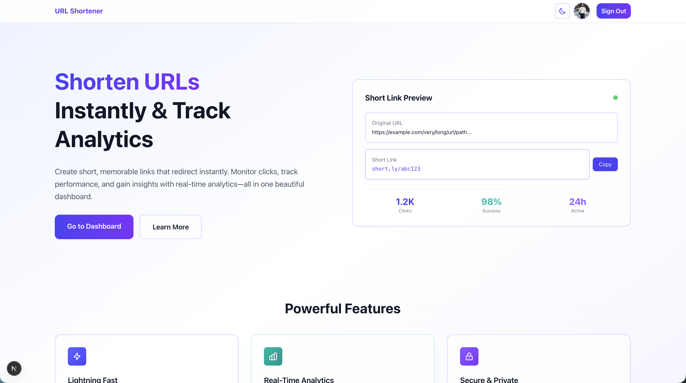
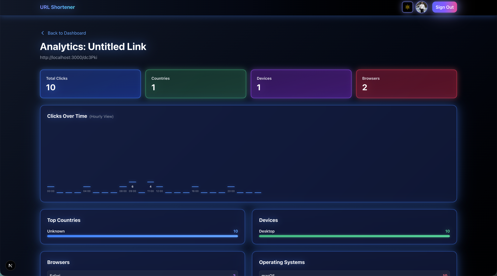
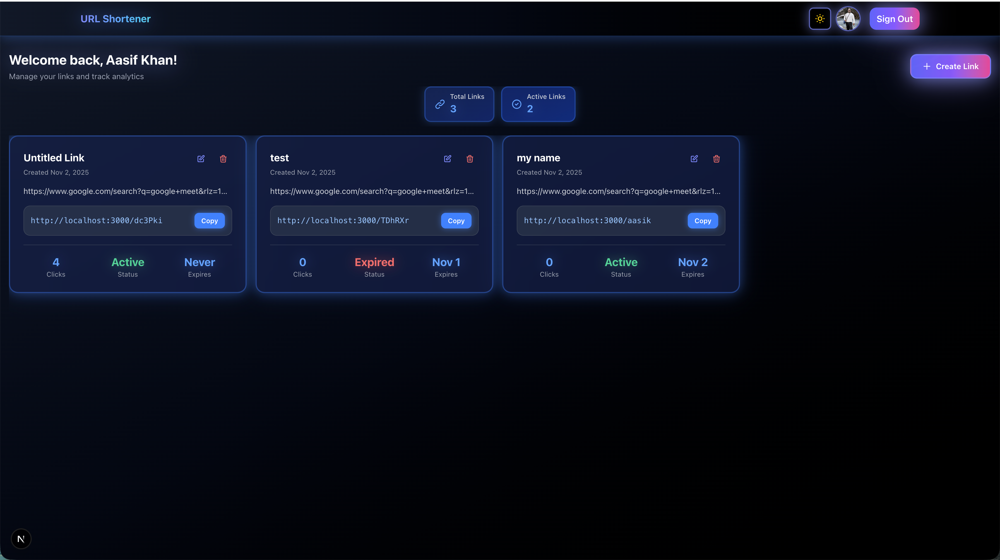

<div align="center">

# 🔗 URL Shortener

**Transform long URLs into short, shareable links with real-time analytics**

[](https://nextjs.org/)
[](https://reactjs.org/)
[](https://tailwindcss.com/)
[](https://www.typescriptlang.org/)


</div>

---

## ✨ Features

### 🚀 Core Functionality
- **⚡ Lightning Fast** - Instant URL shortening with sub-millisecond redirect times
- **📊 Real-Time Analytics** - Track clicks, geographic data, referrers, and device types
- **🎨 Beautiful UI** - Modern, responsive design with dark mode support
- **🔒 Secure & Private** - Custom expiration dates and private link management
- **📱 Mobile Responsive** - Works seamlessly across all devices

### 🎯 Advanced Features
- **📈 Interactive Dashboard** - Monitor performance with beautiful charts and statistics
- **🔐 Google Authentication** - Quick and secure login with NextAuth
- **🌙 Dark Mode** - Eye-friendly dark theme with neon effects
- **📋 Link Management** - Create, edit, and delete your short links
- **🔄 Real-Time Updates** - Live analytics updates using Socket.io
- **💾 Persistent Storage** - Redux Persist for seamless data management

---

## 🛠️ Tech Stack

### Frontend
- **[Next.js 16](https://nextjs.org/)** - React framework with App Router
- **[React 19](https://reactjs.org/)** - UI library
- **[Tailwind CSS 4](https://tailwindcss.com/)** - Utility-first CSS framework
- **[Redux Toolkit](https://redux-toolkit.js.org/)** - State management
- **[NextAuth.js](https://next-auth.js.org/)** - Authentication
- **[Axios](https://axios-http.com/)** - HTTP client
- **[Socket.io Client](https://socket.io/)** - Real-time updates

### Key Libraries
- `next-themes` - Theme switching
- `react-redux` - React bindings for Redux
- `redux-persist` - State persistence
- `react-datepicker` - Date selection component

---

## 📦 Installation

### Prerequisites
- Node.js 18+ and npm/yarn/pnpm
- Git

### Setup Steps

1. **Clone the repository**
   ```bash
   git clone <your-repo-url>
   cd url-shortener-frontend
   ```

2. **Install dependencies**
   ```bash
   npm install
   # or
   yarn install
   # or
   pnpm install
   ```

3. **Set up environment variables**
   
   Create a `.env.local` file in the root directory:
   ```env
   NEXTAUTH_URL=http://localhost:3000
   NEXTAUTH_SECRET=your-secret-key-here
   
   # Google OAuth (if using Google login)
   GOOGLE_CLIENT_ID=your-google-client-id
   GOOGLE_CLIENT_SECRET=your-google-client-secret
   
   # API Backend URL
   NEXT_PUBLIC_API_URL=http://localhost:5000/api
   ```

4. **Run the development server**
   ```bash
   npm run dev
   # or
   yarn dev
   # or
   pnpm dev
   ```

5. **Open your browser**
   
   Navigate to [http://localhost:3000](http://localhost:3000)

---

## 🚀 Usage

### Creating a Short Link

1. **Sign in** with your Google account
2. Click **"Create Link"** button on the dashboard
3. Enter your long URL and optional custom slug
4. Click **"Create"** to generate your short link
5. Copy and share your short link!

### Viewing Analytics

1. Navigate to your **Dashboard**
2. Click on any link card to view detailed analytics
3. Monitor clicks, geographic data, and performance metrics
4. View real-time updates in the analytics panel

### Managing Links

- **Edit**: Click the edit icon on any link card
- **Delete**: Click the delete icon and confirm
- **View Stats**: Click on a link to see detailed analytics

---

## 📁 Project Structure

```
url-shortener-frontend/
├── src/
│   ├── app/                    # Next.js App Router
│   │   ├── [slug]/            # Dynamic route for shortened URLs
│   │   ├── dashboard/         # Dashboard pages
│   │   │   └── analytics/     # Analytics pages
│   │   ├── api/               # API routes
│   │   │   └── auth/         # NextAuth configuration
│   │   ├── layout.js          # Root layout
│   │   └── page.js            # Home page
│   ├── components/            # React components
│   │   ├── DashboardContent.js
│   │   ├── LinkCard.js
│   │   ├── LinkForm.js
│   │   ├── AnalyticsPanel.js
│   │   └── ...
│   ├── lib/                   # Utility libraries
│   │   ├── auth.js           # Auth configuration
│   │   ├── axios.js          # API client
│   │   └── storage.js        # Storage utilities
│   └── store/                # Redux store
│       ├── store.js
│       ├── slices/
│       └── hooks.js
├── docs/                      # Documentation
│   └── screenshots/          # Screenshot images
├── public/                    # Static assets
├── .gitignore
├── package.json
└── README.md
```

---

## 🎨 Screenshots

### Dashboard View


### Analytics Panel


### Dark Mode


### Home Page


---

## 📸 How to Add Screenshots

### Method 1: Store in Repository (Recommended)

1. **Take screenshots** of your application:
   - Dashboard view
   - Analytics panel
   - Dark mode view
   - Home page

2. **Save them** in the `docs/screenshots/` folder with these names:
   - `dashboard.png` - Dashboard screenshot
   - `analytics.png` - Analytics panel screenshot
   - `dark-mode.png` - Dark mode screenshot
   - `home-page.png` - Home page screenshot

3. **Recommended screenshot tools:**
   - **Mac**: `Cmd + Shift + 4` (select area) or `Cmd + Shift + 3` (full screen)
   - **Windows**: `Windows + Shift + S` (Snipping Tool)
   - **Linux**: Use `gnome-screenshot` or similar tools

4. **Optimize images** (optional but recommended):
   ```bash
   # Install image optimization tools
   npm install -g sharp-cli
   
   # Or use online tools like:
   # - TinyPNG.com
   # - Squoosh.app
   ```

### Method 2: Use GitHub Issues/PR Comments

1. Drag and drop images into GitHub Issues or PR comments
2. GitHub will provide a URL like: `https://user-images.githubusercontent.com/...`
3. Copy the URL and use it in the README

### Method 3: External Image Hosting

Use services like:
- [Imgur](https://imgur.com/) - Free image hosting
- [Cloudinary](https://cloudinary.com/) - Image CDN
- [GitHub Assets](https://github.com) - Upload to a GitHub repository

Then use the URL in markdown:
```markdown

```

---

## 🔧 Available Scripts

```bash
# Development
npm run dev              # Start development server
npm run dev:network      # Start dev server accessible on network

# Production
npm run build            # Build for production
npm run start           # Start production server
npm run start:network    # Start production server on network

# Code Quality
npm run lint             # Run ESLint
```

---

## 🌐 Deployment

### Vercel (Recommended)

1. Push your code to GitHub
2. Import your repository on [Vercel](https://vercel.com)
3. Add your environment variables
4. Deploy!

[](https://vercel.com/new)

### Other Platforms

This Next.js app can be deployed on any platform that supports Node.js:
- **Netlify**
- **Railway**
- **Render**
- **AWS Amplify**
- **DigitalOcean App Platform**

---

## 🤝 Contributing

Contributions are welcome! Please feel free to submit a Pull Request.

1. Fork the repository
2. Create your feature branch (`git checkout -b feature/AmazingFeature`)
3. Commit your changes (`git commit -m 'Add some AmazingFeature'`)
4. Push to the branch (`git push origin feature/AmazingFeature`)
5. Open a Pull Request

---

## 📝 Environment Variables

Make sure to set up the following environment variables:

| Variable | Description | Required |
|----------|-------------|----------|
| `NEXTAUTH_URL` | Your application URL | ✅ |
| `NEXTAUTH_SECRET` | Secret for NextAuth | ✅ |
| `GOOGLE_CLIENT_ID` | Google OAuth Client ID | ❌ |
| `GOOGLE_CLIENT_SECRET` | Google OAuth Client Secret | ❌ |
| `NEXT_PUBLIC_API_URL` | Backend API URL | ✅ |

---

## 🐛 Troubleshooting

### Issue: Authentication not working
- Check your `NEXTAUTH_SECRET` is set correctly
- Verify Google OAuth credentials if using Google login

### Issue: API calls failing
- Ensure `NEXT_PUBLIC_API_URL` is set correctly
- Check that your backend server is running

### Issue: Build errors
- Clear `.next` folder and `node_modules`
- Run `npm install` again
- Check Node.js version (requires 18+)

---

## 📄 License

This project is licensed under the MIT License - see the LICENSE file for details.

---

## 🙏 Acknowledgments

- [Next.js](https://nextjs.org/) for the amazing framework
- [Tailwind CSS](https://tailwindcss.com/) for the utility-first CSS
- [Vercel](https://vercel.com/) for deployment platform
- All the amazing open-source contributors

---

<div align="center">

**Made with ❤️ using Next.js**

[⭐ Star this repo](https://github.com/yourusername/url-shortener-frontend) • [🐛 Report Bug](https://github.com/yourusername/url-shortener-frontend/issues) • [💡 Request Feature](https://github.com/yourusername/url-shortener-frontend/issues)

</div>
